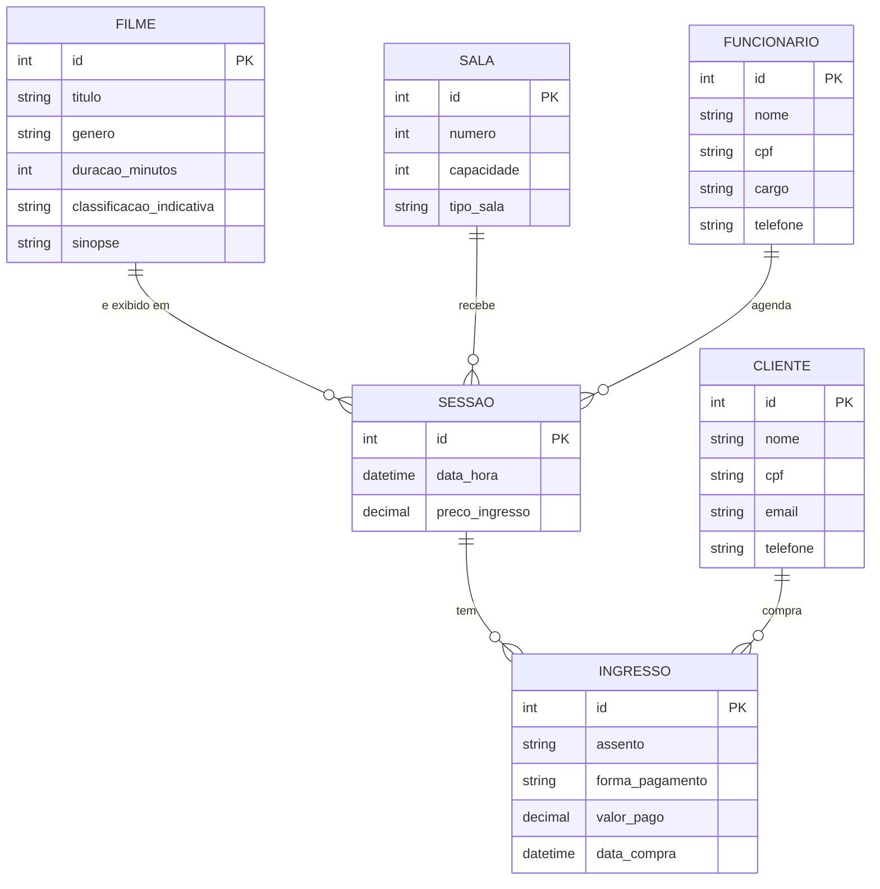

# Modelo Conceitual - Sistema de Cinema

## Leitura das cardinalidades

- Um **filme** pode ser exibido em várias **sessões**; cada sessão exibe um único filme.
- Uma **sala** recebe várias **sessões** (em horários diferentes); cada sessão ocorre em uma única sala.
- Um **funcionário** agenda várias **sessões**; cada sessão é agendada por um funcionário.
- Uma **sessão** tem vários **ingressos** (um por assento); cada ingresso pertence a uma sessão.
- Um **cliente** compra vários **ingressos**; cada ingresso é comprado por um cliente.

## Observações

- **Sessão** e **Ingresso** são entidades associativas: Sessão liga Filme, Sala e Funcionário; Ingresso liga Sessão e Cliente.
- Por ser conceitual, o diagrama não traz chaves estrangeiras nem tipos específicos do SQLite. Os identificadores aparecem só como `id`.
- Restrições de negócio:
  - Uma sala não pode ter duas sessões no mesmo horário.
  - Um assento não pode ser vendido duas vezes na mesma sessão.
  - CPF é único para funcionário e cliente.
